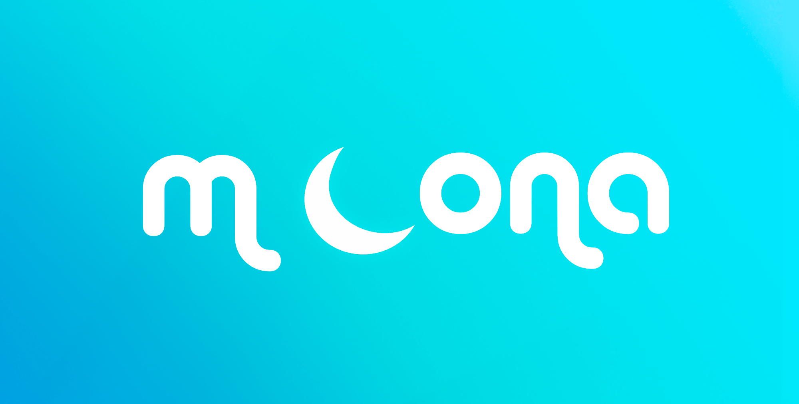

# P.S.

Это мой первый сайт, который я разрабатывал вместе с Дарьей Толменевой, когда мы учились в Яндекс Лицее.

# MOONA

**moona** – это сайт-дневник, который позволяет поделится своими мыслями с другими пользователями. На сайте после
регистрации, можно добавлять записи в свой личный дневник и при желании делать запись доступной для всех пользователей
сайта.

Moona выполнена в светло-голубых тонах, чтобы пользователей ничего не отвлекало от использования нашего сайта. На нашем
сайте каждый сможет найти что-то подходящее для себя: каждый в праве писать посты для всех или только для себя.

Чуть позже здесь появятся картинки нашего сайта с окончательным дизайном, нужно лишь чуть чуть подождать

Посмотреть наш сайт вы можете перейдя по ссылке https://moona.net.ru/diary/
____

# Контактики

### Email:

- andrei@duvakin.ru
- tolmenevadarya@yandex.ru
- moonadiary@yandex.ru (оффициальная почта)

### VK:

- https://vk.com/andreiduvakin
- https://vk.com/s_plombir19

### Telegram:

- @andrei_duvakin
- @DinPg
